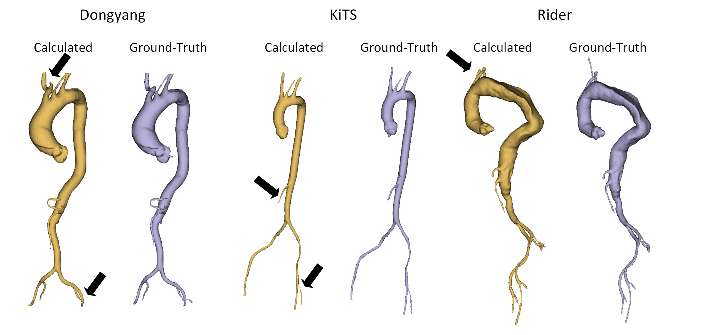
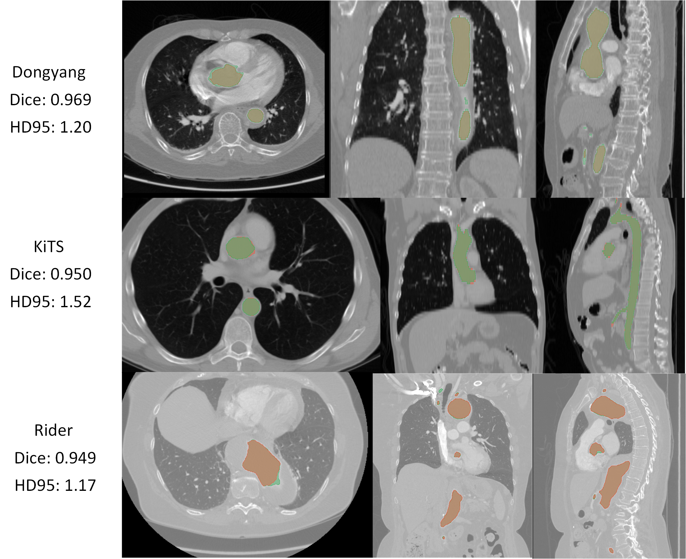
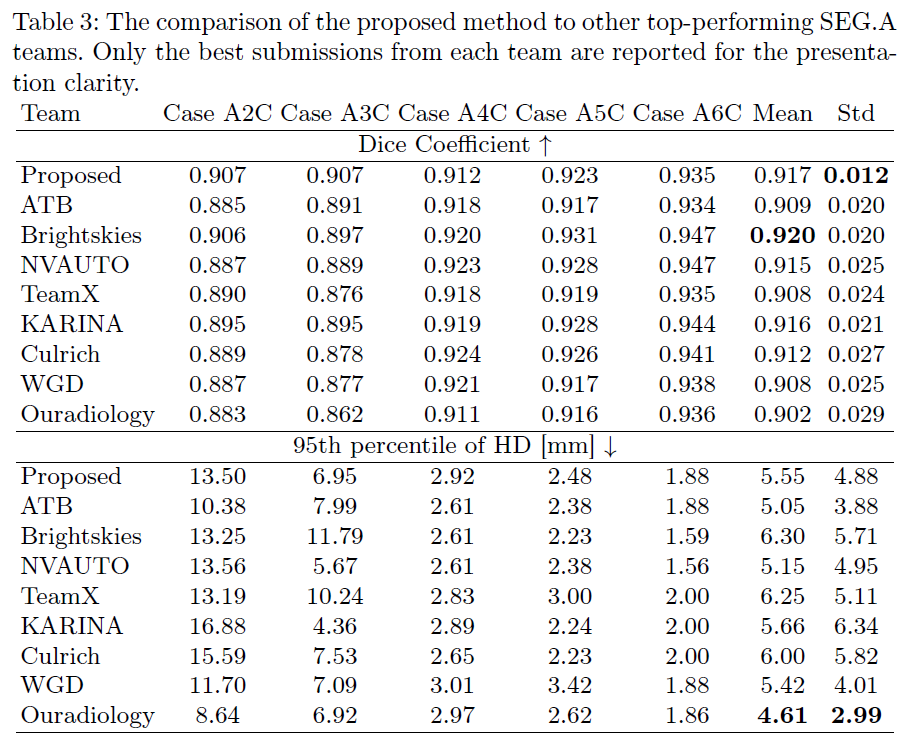

# SEG.A - 2023
Contribution to the SEG.A Challenge (MICCAI 2023) by Marek Wodzinski.

The repository presents the contribution to the SEG.A Challenge that scored:
   * 1st place in the clinical evaluation
   * 4th place in the evaluation based on quantiative metrics
   * 3rd place in the volumetric meshing quality

The challenge website: [Link](https://multicenteraorta.grand-challenge.org/multicenteraorta/)

The repository provides the full source code used to train / test the proposed solution.

# Results
The exemplary qualitative results obtained by the method and compared to the ground-truth are visible below:

Exemplary cases from each medical center from the cross-validation dataset:

And finally, the quantitative comparison to other challenge participants is as follows:

# Reproducibility

Only the final experiment is available in the repository (the one used for the final Docker submission).

* In order to reproduce the experiment you should:
    * Download the SEG.A dataset [Link](https://multicenteraorta.grand-challenge.org/data/)
    * Update the [hpc_paths.py](./src/paths/hpc_paths.py) and [paths.py](./src/paths/paths.py) files.
    * Run the [parse_sega.py](./src/parsers/parse_sega.py)
    * Run the [run_aug_sega.py](./src/parsers/run_aug_sega.py)
    * Run the training using [run_segmentation_trainer.py](./src/runners/run_segmentation_trainer.py)
    * And finally use the trained model for inference using [inference.py](./src/inference/inference_sega.py)

The network was trained using HPC infrastructure (PLGRID). Therefore the .slurm scripts are omitted for clarity.

# Inference 

In case you are interested in just running the code:
* If you want to run the model locally - the final model is available upon reasonable request.
* You can also apply for an access to the algorithm directly using the Grand-Challenge platform: [Link](https://grand-challenge.org/algorithms/sega_mw/). Access will be provided without restrictions.

# Publications

If you found the source code useful, please cite:
 * The SEG.A Challenge Paper - Will Be There Soon
 * The paper presenting the proposed solution:
      * arXiv: [Paper](https://arxiv.org/abs/2310.15827)
      * Springer: Will Be There Soon

# Acknowledgements

We gratefully acknowledge Polish HPC infrastructure PLGrid support within computational grant no. PLG/2023/016239.
